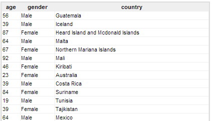
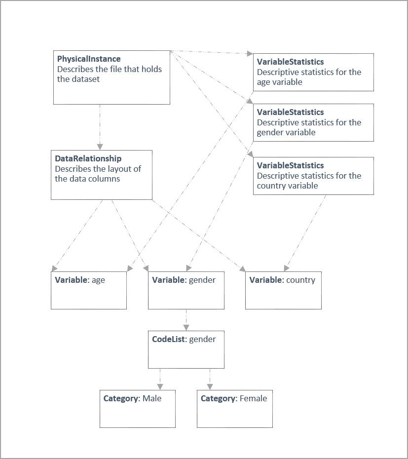
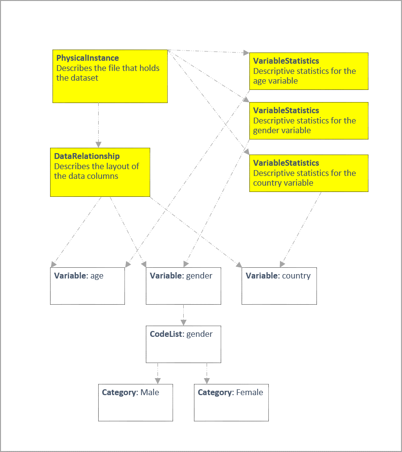
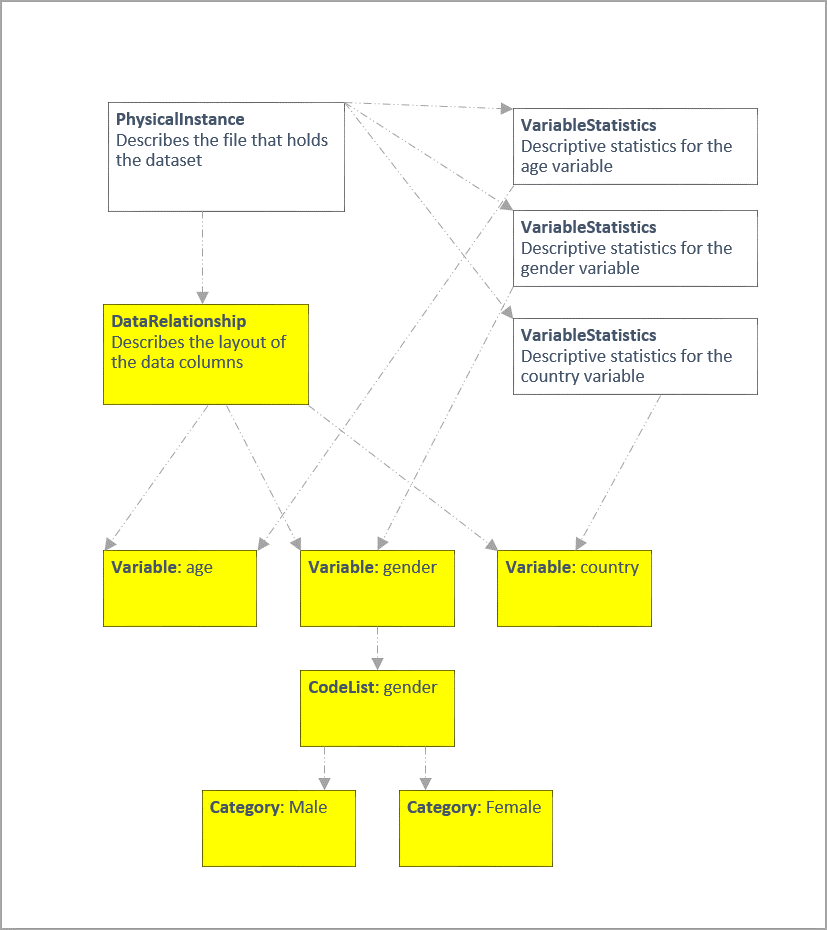

# Colectica Repository Search Capabilities

Colectica Repository is used to store graphs of items. As an example, let's look at a very small dataset and see how it can be described using metadata items registered with the repository.



Here is a graph of items that describe the dataset.



Colectica Repository provides several ways to search this information.

|------------ | -------------------------------------------- |
| Item search         | Find all items that match certain criteria. |
| Relationship search | Find all items directly related to an item. |
| Set search          | Find all items in an item's set, where a set includes all items connected to the item, no matter how many links are followed. |

The following sections provide details and sample code to implement each of these types of searches. The samples use Colectica SDK, but all the functionality is exposed as web services and can be accessed without the SDK, if preferred.

## Item Search

The basic item search looks at the entire repository for items that match the specified criteria.

Common search criteria include the type of the item and text contents of the item. The full list of criteria is below.

| Property               | Description                                                                            |
| ---------------------- | -----------------------------------------------------------------------                |
| SearchTerms            | Text that appears in the item content.                                                 |
| ItemTypes              | Only look for certain types of items. If empty, all item types will be searched.       |
| SearchTargets          | Limit text searches to certain fields, such as the Label.                              |
| Cultures               | The languages to be searched for any SearchTerms.                                      |
| MaxResults             | The maximum number of results to be returned.                                          |
| ResultOffset           | The offset of the first result to be returned. This is used for paging search results. |
| RankResults            | Whether to rank search results by MetadataRank.                                        |
| ResultOrdering         | The order of the search results: alphabetical, by type, by rank, or by date.           |
| SearchLatestVersion    | Whether to only include the latest versions of items in the search results.            |
| SearchDeprectatedItems | Whether deprecated items should be included in search results.                         |
| UsePrefixSearch        | Whether the text search should look at word prefixes instead of whole words.           |

### Colectica SDK Sample: Item Search

```csharp
// Search the entire repository for all variables with the word 
// "age".
var facet = new SearchFacet();
facet.ItemTypes.Add(DdiItemType.Variable);
facet.SearchTerms.Add("age");

// Perform the search.
var response = client.Search(facet);

// Show a summary of the search results. How many items were found
// and how long the search took.
Console.WriteLine(string.Format(
    "Displaying {0} of {1} results. Search took {2}.",
    response.ReturnedResults,
    response.TotalResults,
    response.RepositoryTime));

// Write a line for each result.
foreach (var result in response.Results)
{
    Console.WriteLine(result.Label["en-US"]);
}
```

## Relationship Search

A relationship search looks only at items directly related to a specified item. The highlighted items below are the items that will be searched when performing a relationship search on the PhysicalInstance.




Within these items, results can be filtered by item type. The full list of facets for relationship searches is below.

| Property              | Description                                                                                                                    |
| --------              | -----------                                                                                                                    |
| TargetItem            | The item to which all results must be directly related.                                                                        |
| ItemTypes             | The types of items to be found. If empty, all item types will be searched.                                                     |
| Predicate             | The types of relationships to be followed. Currently all relationships are of the same type: ResourceReference.                |
| UseDistinctTargetItem | Whether only the explicit version of the target item will be searched, or if all versions of the target item will be searched. |
| UseDistinctResultItem | Whether only one version of each matching item will be returned, or if all matching versions of items should be returned.      |

### Colectica SDK Sample: Relationship Search

```csharp
// Search for all VariableStatistics related to the PhysicalInstance.
var facet = new GraphSearchFacet();
facet.TargetItem = physicalInstanceIdentifier;
facet.UseDistinctTargetItem = true;
facet.UseDistinctResultItem = true;
facet.ItemTypes.Add(DdiItemType.VariableStatistic);

// Perform the search.
var results = client.GetRepositoryItemDescriptionsBySubject(facet);

// Write a line for each result.
foreach (var result in results)
{
    Console.WriteLine(result.Label["en-US"]);
}
```

## Set Search

A set search looks at all items in an item's set. An item's set is defined as all items connected to the item, no matter how many links are followed. The highlighted items below are the items that will be searched when performing a set search on the DataRelationship.



Within these items, results can be filtered by item type. A full list of facets for set searches is below.

| Property         | Description                                                                                                                                            |
| --------         | -----------                                                                                                                                            |
| ItemTypes        | The types of items to be found. If empty, all item types will be searched.                                                                             |
| LeafItemTypes    | Types of items to treat as leafs, which can speed up the search by preventing the searcher from following certain paths that will not contain results. |
| Predicate        | The types of relationships to be followed. Currently all relationships are of the same type: ResourceReference.                                        |
| ReverseTraversal | Whether the set to search is defined as all items under the target item, or all items that contain the target item in their set.                       |

### Colectica SDK Sample: Set Search

```csharp
// Search for all Categories in the DataRelationship's set.
var facet = new SetSearchFacet();
facet.ItemTypes.Add(DdiItemType.Category);

var resultIdentifiers = client.SearchTypedSet(
    dataRelationshipIdentifier, 
    facet);

// The set search only returns the identifiers of items.
// Request the description of each result here.
var results = client.GetRepositoryItemDescriptions(
    resultIdentifiers.ToIdentifierCollection());

// Write a line for each result.
foreach (var result in results)
{
    Console.WriteLine(result.Label["en-US"]);
}
```
